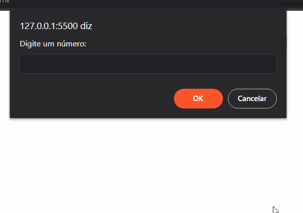

# Explorer-Projeto-09
Projeto de uma calculadora que realiza as operações de:

- SOMA
- SUBTRAÇÃO
- MULTIPLICAÇÃO
- DIVISÃO
- RESTO DA DIVISÃO

Verifica se o resultado da soma é par ou ímpar e se os números digitados são iguais ou não.

## Por dentro do projeto 

  

